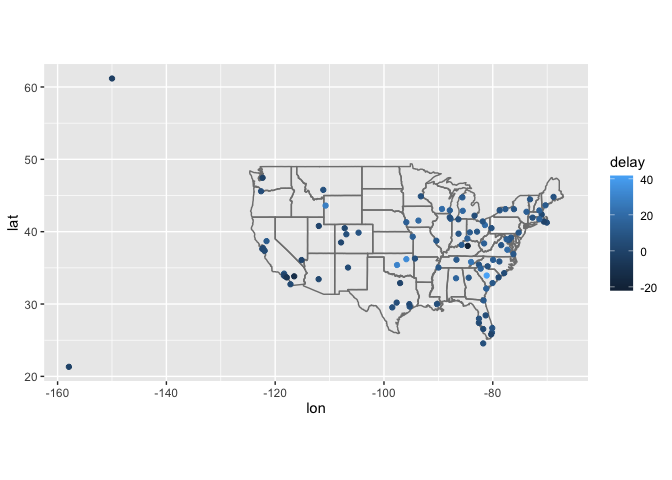
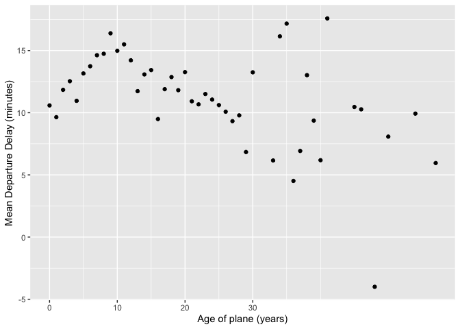
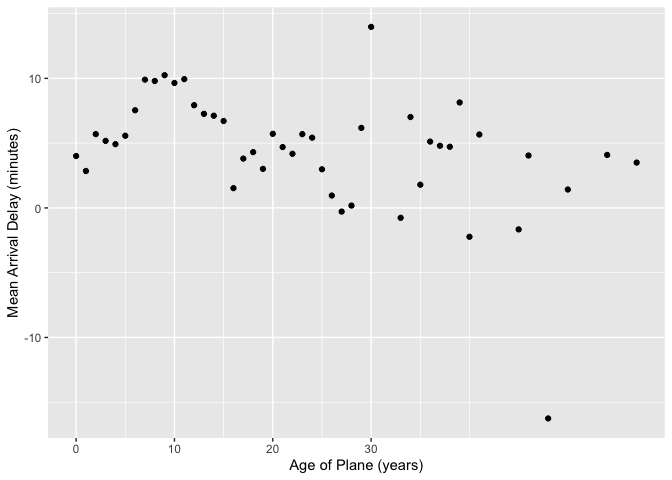

433-HW-3
================
Lanxi Zhang
2022/10/17

## Github:

``` r
library(nycflights13)
library(dplyr)
```

    ## 
    ## Attaching package: 'dplyr'

    ## The following objects are masked from 'package:stats':
    ## 
    ##     filter, lag

    ## The following objects are masked from 'package:base':
    ## 
    ##     intersect, setdiff, setequal, union

``` r
library(ggplot2)
#flights
```

## 13.4.6 Exercises

### 1. Compute the average delay by destination, then join on the airports data frame so you can show the spatial distribution of delays. Here’s an easy way to draw a map of the United States:

``` r
avg_dest_delays <-
  flights %>%
  group_by(dest) %>%
  summarise(delay = mean(arr_delay, na.rm = TRUE)) %>%
  inner_join(airports, by = c(dest = "faa"))


avg_dest_delays %>%
  ggplot(aes(lon, lat, colour = delay)) +
  borders("state") +
  geom_point() +
  coord_quickmap()
```

<!-- -->

### 2.Add the location of the origin and destination (i.e. the lat and lon) to flights.

``` r
airport_locations <- airports %>%
  select(faa, lat, lon)

flights %>%
  select(year:day, hour, origin, dest) %>%
  left_join(
    airport_locations,
    by = c("origin" = "faa")
  ) %>%
  left_join(
    airport_locations,
    by = c("dest" = "faa"),
    suffix = c("_origin", "_dest")
  )
```

    ## # A tibble: 336,776 × 10
    ##     year month   day  hour origin dest  lat_origin lon_origin lat_dest lon_dest
    ##    <int> <int> <int> <dbl> <chr>  <chr>      <dbl>      <dbl>    <dbl>    <dbl>
    ##  1  2013     1     1     5 EWR    IAH         40.7      -74.2     30.0    -95.3
    ##  2  2013     1     1     5 LGA    IAH         40.8      -73.9     30.0    -95.3
    ##  3  2013     1     1     5 JFK    MIA         40.6      -73.8     25.8    -80.3
    ##  4  2013     1     1     5 JFK    BQN         40.6      -73.8     NA       NA  
    ##  5  2013     1     1     6 LGA    ATL         40.8      -73.9     33.6    -84.4
    ##  6  2013     1     1     5 EWR    ORD         40.7      -74.2     42.0    -87.9
    ##  7  2013     1     1     6 EWR    FLL         40.7      -74.2     26.1    -80.2
    ##  8  2013     1     1     6 LGA    IAD         40.8      -73.9     38.9    -77.5
    ##  9  2013     1     1     6 JFK    MCO         40.6      -73.8     28.4    -81.3
    ## 10  2013     1     1     6 LGA    ORD         40.8      -73.9     42.0    -87.9
    ## # … with 336,766 more rows

### 3.Is there a relationship between the age of a plane and its delays?

``` r
planes_new<-planes %>% 
  select(tailnum,plane_year=year)
plane_new <-
  flights %>% 
  inner_join(planes_new,by="tailnum") %>% 
  mutate(age=year-plane_year) %>% 
   group_by(age) %>%
  summarise(
    dep_delay_mean = mean(dep_delay, na.rm = TRUE),
    dep_delay_sd = sd(dep_delay, na.rm = TRUE),
    arr_delay_mean = mean(arr_delay, na.rm = TRUE),
    arr_delay_sd = sd(arr_delay, na.rm = TRUE),
    n_arr_delay = sum(!is.na(arr_delay)),
    n_dep_delay = sum(!is.na(dep_delay))
  )
```

-   This question doesn’t mention whether is the departure delay or the
    arrival delay, so we need to check the two kinds of delay:

-   For the departure delay, we make the scatter plot of the
    relationship between the planes’ age and the departure delay. From
    the plot, we can find that the average departure delay is increasing
    for planes with ages up until 10 years. After that the departure
    delay decreases or levels off.

``` r
ggplot(plane_new, aes(x = age, y = dep_delay_mean)) +
  geom_point() +
  scale_x_continuous("Age of plane (years)", breaks = seq(0, 30, by = 10)) +
  scale_y_continuous("Mean Departure Delay (minutes)")
```

    ## Warning: Removed 1 rows containing missing values (geom_point).

<!-- -->

-   There is a similar relationship in arrival delays. The delays
    increase with the age of the plane until ten years, then it declines
    and flattens out.

``` r
ggplot(plane_new, aes(x = age, y = arr_delay_mean)) +
  geom_point() +
  scale_x_continuous("Age of Plane (years)", breaks = seq(0, 30, by = 10)) +
  scale_y_continuous("Mean Arrival Delay (minutes)")
```

    ## Warning: Removed 1 rows containing missing values (geom_point).

<!-- -->
