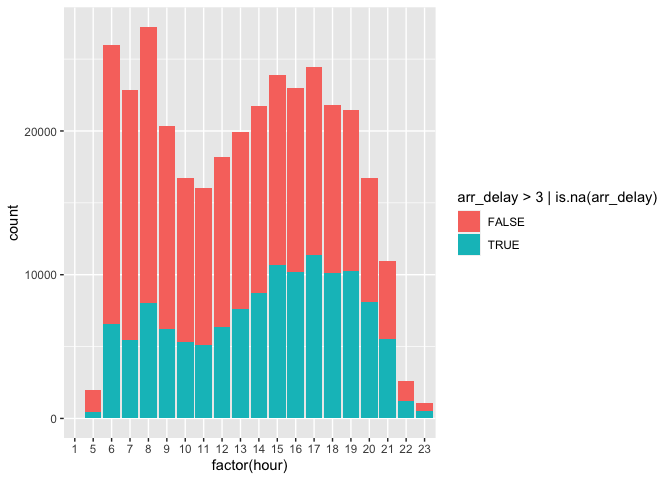
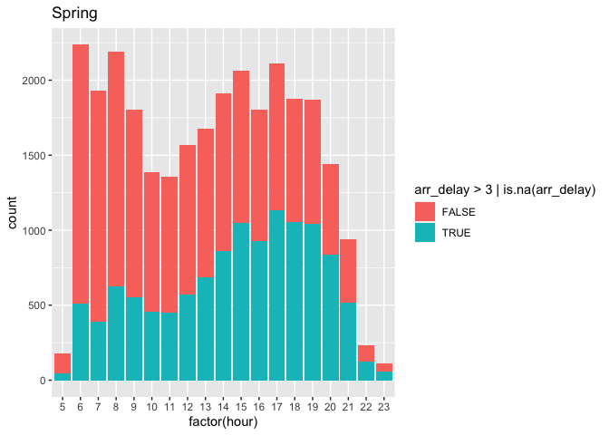
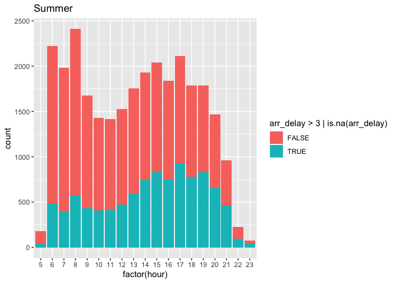
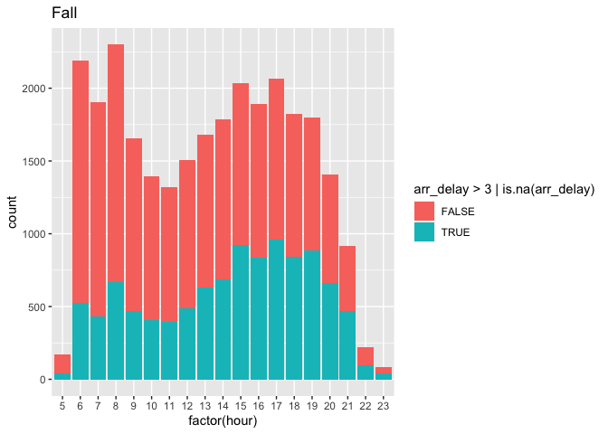
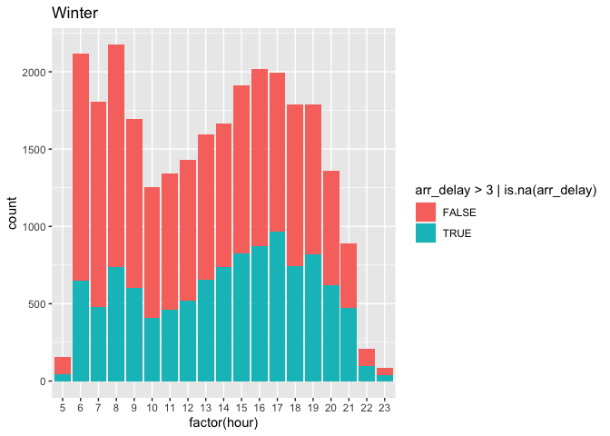
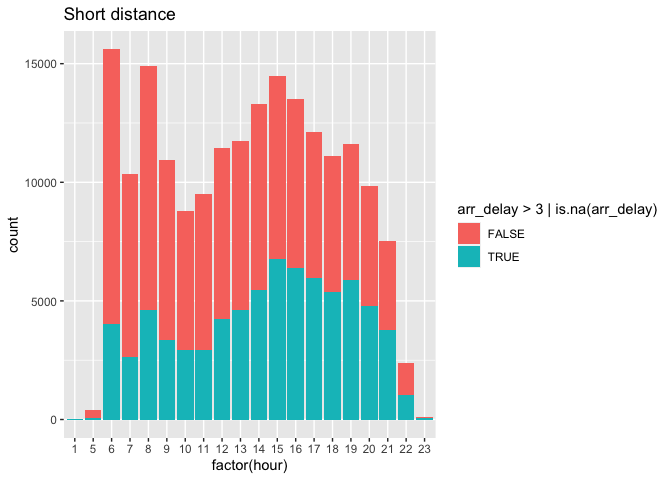
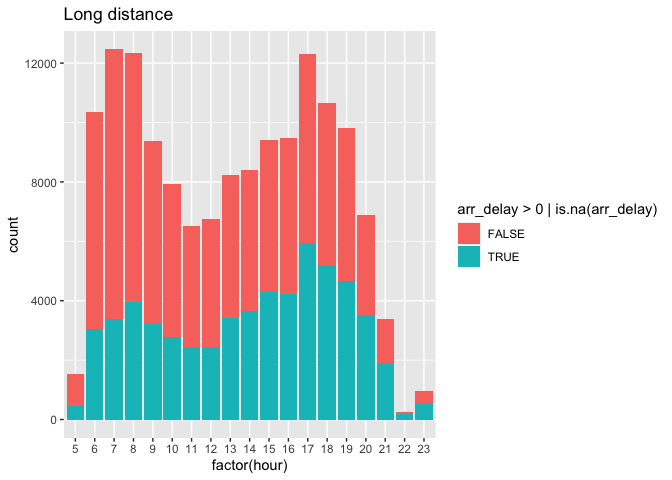

433-HW-2
================
Lanxi Zhang
2022/10/12

``` r
library(nycflights13)
library(dplyr)
```

    ## 
    ## Attaching package: 'dplyr'

    ## The following objects are masked from 'package:stats':
    ## 
    ##     filter, lag

    ## The following objects are masked from 'package:base':
    ## 
    ##     intersect, setdiff, setequal, union

``` r
library(ggplot2)
#flights
```

### What time of day should you fly if you want to avoid delays as much as possible?

##### We group by the hour of the flights, and we can find that the earlier hour, the lower its expected delay. That’s maybe because delays will affect later flights, and morning flights have fewer previous flights that can delay them. So to aviod delays we better choose to fly in the morning.

``` r
flights %>% 
  group_by(hour) %>% 
  summarise(arr_delay=mean(arr_delay, na.rm = TRUE)) %>% 
  arrange(arr_delay)
```

    ## # A tibble: 20 × 2
    ##     hour arr_delay
    ##    <dbl>     <dbl>
    ##  1     7    -5.30 
    ##  2     5    -4.80 
    ##  3     6    -3.38 
    ##  4     9    -1.45 
    ##  5     8    -1.11 
    ##  6    10     0.954
    ##  7    11     1.48 
    ##  8    12     3.49 
    ##  9    13     6.54 
    ## 10    14     9.20 
    ## 11    23    11.8  
    ## 12    15    12.3  
    ## 13    16    12.6  
    ## 14    18    14.8  
    ## 15    22    16.0  
    ## 16    17    16.0  
    ## 17    19    16.7  
    ## 18    20    16.7  
    ## 19    21    18.4  
    ## 20     1   NaN

##### We can see that the highest probability of delay as a proportion of total flights is in the late evening. We could hypothesize that this is due to accumulated knockon delays during the day, the difficulties of flying at night, or these flights being typically longer distance.

``` r
flights %>% 
  ggplot(aes(x=factor(hour), fill=arr_delay>3 | is.na(arr_delay))) + geom_bar()
```

<!-- -->

### 1. Does this choice depend on Season?

``` r
flights %>% 
  group_by(hour,month) %>% 
  summarise(arr_delay=mean(arr_delay, na.rm = TRUE)) %>% 
  arrange(arr_delay)
```

    ## `summarise()` has grouped output by 'hour'. You can override using the `.groups`
    ## argument.

    ## # A tibble: 229 × 3
    ## # Groups:   hour [20]
    ##     hour month arr_delay
    ##    <dbl> <int>     <dbl>
    ##  1     5     9    -13.5 
    ##  2     9     9    -13.0 
    ##  3     7     9    -12.5 
    ##  4     6     9    -11.4 
    ##  5     7     5    -11.0 
    ##  6     8     9     -9.95
    ##  7     5    11     -9.86
    ##  8     5     5     -9.48
    ##  9     6     5     -9.22
    ## 10     5    10     -8.68
    ## # … with 219 more rows

``` r
flights %>% 
  filter(month==(4:7)) %>% 
  arrange(hour) %>% 
  ggplot(aes(x=factor(hour), fill=arr_delay>3 | is.na(arr_delay))) + geom_bar()+ggtitle("Spring")
```

<!-- -->

``` r
flights %>% 
  filter(month==(7:10)) %>% 
  arrange(hour) %>% 
  ggplot(aes(x=factor(hour), fill=arr_delay>3 | is.na(arr_delay))) + geom_bar()+ggtitle("Summer")
```

<!-- -->

``` r
flights %>% 
  filter(month==(10:1)) %>% 
  arrange(hour) %>% 
  ggplot(aes(x=factor(hour), fill=arr_delay>3 | is.na(arr_delay))) + geom_bar()+ggtitle("Fall")
```

    ## Warning in month == (10:1): 长的对象长度不是短的对象长度的整倍数

<!-- -->

``` r
flights %>% 
  filter(month==(1:4)) %>% 
  arrange(hour) %>% 
  ggplot(aes(x=factor(hour), fill=arr_delay>3 | is.na(arr_delay))) + geom_bar()+ggtitle("Winter")
```

<!-- -->

##### We can see from the four graphs above that for all four seasons, spring, summer, fall and winter, 5am to 10am is the best time period to fly. It seems that the best flight time period (the minimum possible delay time period) is not particularly related to the four seasons.

### 2. Does this choice depend on Airline (Carrier) ?

``` r
flights %>% 
  group_by(hour,carrier) %>% 
  summarise(arr_delay=mean(arr_delay, na.rm = TRUE)) %>% 
  arrange(arr_delay)
```

    ## `summarise()` has grouped output by 'hour'. You can override using the `.groups`
    ## argument.

    ## # A tibble: 207 × 3
    ## # Groups:   hour [20]
    ##     hour carrier arr_delay
    ##    <dbl> <chr>       <dbl>
    ##  1    12 VX          -36.3
    ##  2     7 F9          -22  
    ##  3    11 VX          -18.5
    ##  4     7 AS          -18.2
    ##  5    20 YV          -17.8
    ##  6     6 YV          -17.5
    ##  7    18 YV          -15  
    ##  8    15 YV          -14.4
    ##  9     7 VX          -12.7
    ## 10    23 DL          -11.4
    ## # … with 197 more rows

##### We plot a line graph to see the delays of different airlines at different times, and we take delays greater than 3 as the discriminator here, and plot the following line graph.

##### As you can see the line graph overall, different airlines have different time periods for the lowest delays, for example, EV has the lowest delays around 7am to 12am. MQ and AA have the lowest delays around 7:00 a.m. to 10:00 a.m. HA and F9 have no specific pattern to speak of.

``` r
flights %>% 
  filter(arr_delay >3| is.na(arr_delay)) %>% 
  ggplot(aes(x=hour))+geom_freqpoly(mapping = aes(color = carrier), binwidth =1)
```

<!-- -->

##### In summary, for different airlines the time period of the lowest delay probability is different.

##### And from the direction of the line graph, it can be seen that most of the morning and morning flights have a relatively low probability of delay.

### 3. Does this choice depend on distance ?

##### We tried to find the relationship between distance and the choice of the lowest possible delay time period. In the table below, we did not find a valid and obvious relationship.

``` r
flights %>% 
  group_by(hour,distance) %>% 
  summarise(arr_delay=mean(arr_delay, na.rm = TRUE)) %>% 
  arrange(arr_delay)
```

    ## `summarise()` has grouped output by 'hour'. You can override using the `.groups`
    ## argument.

    ## # A tibble: 2,013 × 3
    ## # Groups:   hour [20]
    ##     hour distance arr_delay
    ##    <dbl>    <dbl>     <dbl>
    ##  1    20     1183     -58  
    ##  2     8     1391     -47  
    ##  3    19      585     -44  
    ##  4    12     1598     -40  
    ##  5    20      963     -38  
    ##  6    18      828     -35.7
    ##  7     8      198     -35.1
    ##  8     7      419     -35  
    ##  9    13      198     -35  
    ## 10    19      641     -35  
    ## # … with 2,003 more rows

``` r
flights %>% 
  filter(distance<1000) %>% 
  arrange(hour) %>% 
  ggplot(aes(x=factor(hour), fill=arr_delay>3 | is.na(arr_delay))) + geom_bar()+ggtitle("Short distance")
```

<!-- -->

``` r
flights %>% 
  filter(distance>1000) %>% 
  arrange(hour) %>% 
  ggplot(aes(x=factor(hour), fill=arr_delay>0 | is.na(arr_delay))) + geom_bar()+ggtitle("Long distance")
```

<!-- -->

##### After searching we found that flights below 1000 km are close flights, so we divided the distances into long and short flights and visualized the analysis.

##### We can see from the graph that for both short-haul and long-haul flights, 5:00 am to 10:00 am is the most suitable (i.e., the least probability of delay) time period.
