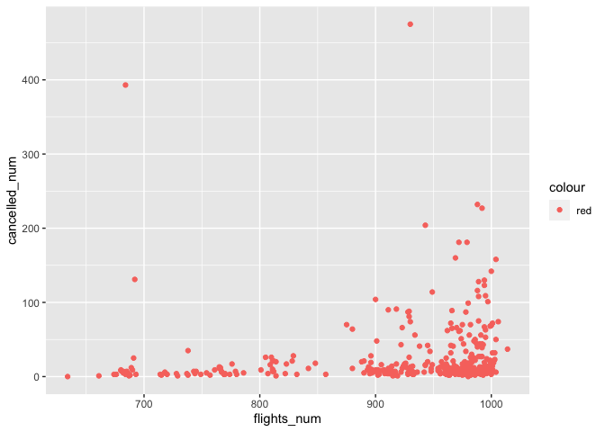
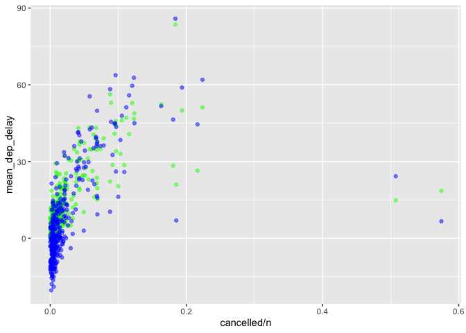

HW-1
================
Lanxi Zhang
9/27/2022

``` r
library(dplyr)
```

    ## 
    ## Attaching package: 'dplyr'

    ## The following objects are masked from 'package:stats':
    ## 
    ##     filter, lag

    ## The following objects are masked from 'package:base':
    ## 
    ##     intersect, setdiff, setequal, union

``` r
# install.packages("nycflights13")
library(nycflights13)
library(ggplot2)
```

``` r
#flights %>% View
```

### 1. How many flights have a missing dep\_time? What other variables are missing? What might these rows represent?

-   8255 flights have a missing `dep_time`, 8255 have a missing
    `dep_delay`, 8713 have a missing `arr_time`, 9430 have a missing
    `arr_delay`, and 9430 have a missing `air_time`.

-   We can speculate that these are flights that failed to depart or
    arrive since a flight that departed normally but was diverted might
    have a normal departure record but no similar arrival record. Or
    these could just be missing data for a perfectly normal flight.

``` r
filter(flights, is.na(flights$dep_time))
```

    ## # A tibble: 8,255 × 19
    ##     year month   day dep_time sched_dep_time dep_delay arr_time sched_arr_time
    ##    <int> <int> <int>    <int>          <int>     <dbl>    <int>          <int>
    ##  1  2013     1     1       NA           1630        NA       NA           1815
    ##  2  2013     1     1       NA           1935        NA       NA           2240
    ##  3  2013     1     1       NA           1500        NA       NA           1825
    ##  4  2013     1     1       NA            600        NA       NA            901
    ##  5  2013     1     2       NA           1540        NA       NA           1747
    ##  6  2013     1     2       NA           1620        NA       NA           1746
    ##  7  2013     1     2       NA           1355        NA       NA           1459
    ##  8  2013     1     2       NA           1420        NA       NA           1644
    ##  9  2013     1     2       NA           1321        NA       NA           1536
    ## 10  2013     1     2       NA           1545        NA       NA           1910
    ## # … with 8,245 more rows, and 11 more variables: arr_delay <dbl>,
    ## #   carrier <chr>, flight <int>, tailnum <chr>, origin <chr>, dest <chr>,
    ## #   air_time <dbl>, distance <dbl>, hour <dbl>, minute <dbl>, time_hour <dttm>

``` r
summary(flights)
```

    ##       year          month             day           dep_time    sched_dep_time
    ##  Min.   :2013   Min.   : 1.000   Min.   : 1.00   Min.   :   1   Min.   : 106  
    ##  1st Qu.:2013   1st Qu.: 4.000   1st Qu.: 8.00   1st Qu.: 907   1st Qu.: 906  
    ##  Median :2013   Median : 7.000   Median :16.00   Median :1401   Median :1359  
    ##  Mean   :2013   Mean   : 6.549   Mean   :15.71   Mean   :1349   Mean   :1344  
    ##  3rd Qu.:2013   3rd Qu.:10.000   3rd Qu.:23.00   3rd Qu.:1744   3rd Qu.:1729  
    ##  Max.   :2013   Max.   :12.000   Max.   :31.00   Max.   :2400   Max.   :2359  
    ##                                                  NA's   :8255                 
    ##    dep_delay          arr_time    sched_arr_time   arr_delay       
    ##  Min.   : -43.00   Min.   :   1   Min.   :   1   Min.   : -86.000  
    ##  1st Qu.:  -5.00   1st Qu.:1104   1st Qu.:1124   1st Qu.: -17.000  
    ##  Median :  -2.00   Median :1535   Median :1556   Median :  -5.000  
    ##  Mean   :  12.64   Mean   :1502   Mean   :1536   Mean   :   6.895  
    ##  3rd Qu.:  11.00   3rd Qu.:1940   3rd Qu.:1945   3rd Qu.:  14.000  
    ##  Max.   :1301.00   Max.   :2400   Max.   :2359   Max.   :1272.000  
    ##  NA's   :8255      NA's   :8713                  NA's   :9430      
    ##    carrier              flight       tailnum             origin         
    ##  Length:336776      Min.   :   1   Length:336776      Length:336776     
    ##  Class :character   1st Qu.: 553   Class :character   Class :character  
    ##  Mode  :character   Median :1496   Mode  :character   Mode  :character  
    ##                     Mean   :1972                                        
    ##                     3rd Qu.:3465                                        
    ##                     Max.   :8500                                        
    ##                                                                         
    ##      dest              air_time        distance         hour      
    ##  Length:336776      Min.   : 20.0   Min.   :  17   Min.   : 1.00  
    ##  Class :character   1st Qu.: 82.0   1st Qu.: 502   1st Qu.: 9.00  
    ##  Mode  :character   Median :129.0   Median : 872   Median :13.00  
    ##                     Mean   :150.7   Mean   :1040   Mean   :13.18  
    ##                     3rd Qu.:192.0   3rd Qu.:1389   3rd Qu.:17.00  
    ##                     Max.   :695.0   Max.   :4983   Max.   :23.00  
    ##                     NA's   :9430                                  
    ##      minute        time_hour                  
    ##  Min.   : 0.00   Min.   :2013-01-01 05:00:00  
    ##  1st Qu.: 8.00   1st Qu.:2013-04-04 13:00:00  
    ##  Median :29.00   Median :2013-07-03 10:00:00  
    ##  Mean   :26.23   Mean   :2013-07-03 05:22:54  
    ##  3rd Qu.:44.00   3rd Qu.:2013-10-01 07:00:00  
    ##  Max.   :59.00   Max.   :2013-12-31 23:00:00  
    ## 

### 2. Currently dep\_time and sched\_dep\_time are convenient to look at, but hard to compute with because they’re not really continuous numbers. Convert them to a more convenient representation of number of minutes since midnight.

``` r
# use integer division
mutate(flights,
       dep_time = (dep_time %/% 100) * 60 + (dep_time %% 100),
       sched_dep_time = (sched_dep_time %/% 100) * 60 + (sched_dep_time %% 100))
```

    ## # A tibble: 336,776 × 19
    ##     year month   day dep_time sched_dep_time dep_delay arr_time sched_arr_time
    ##    <int> <int> <int>    <dbl>          <dbl>     <dbl>    <int>          <int>
    ##  1  2013     1     1      317            315         2      830            819
    ##  2  2013     1     1      333            329         4      850            830
    ##  3  2013     1     1      342            340         2      923            850
    ##  4  2013     1     1      344            345        -1     1004           1022
    ##  5  2013     1     1      354            360        -6      812            837
    ##  6  2013     1     1      354            358        -4      740            728
    ##  7  2013     1     1      355            360        -5      913            854
    ##  8  2013     1     1      357            360        -3      709            723
    ##  9  2013     1     1      357            360        -3      838            846
    ## 10  2013     1     1      358            360        -2      753            745
    ## # … with 336,766 more rows, and 11 more variables: arr_delay <dbl>,
    ## #   carrier <chr>, flight <int>, tailnum <chr>, origin <chr>, dest <chr>,
    ## #   air_time <dbl>, distance <dbl>, hour <dbl>, minute <dbl>, time_hour <dttm>

### 3. Look at the number of canceled flights per day. Is there a pattern? Is the proportion of canceled flights related to the average delay? Use multiple dyplr operations, all on one line, concluding with ggplot(aes(x= ,y=)) + geom\_point()

#### 3(1)

``` r
flights %>%
  mutate(cancelled = (is.na(arr_delay) | is.na(dep_delay))) %>%
  group_by(year, month, day) %>%
  summarise(
    cancelled_num = sum(cancelled),
    flights_num = n(),
  ) %>% 
  ggplot() +
  geom_point(aes(x = flights_num, y = cancelled_num,color =  "red")) 
```

    ## `summarise()` has grouped output by 'year', 'month'. You can override using the
    ## `.groups` argument.

<!-- -->

-   The first part asks about the pattern of the number of canceled
    flights per day. By looking at the relationship between the number
    of canceled flights per day and the total number of flights per day,
    see the graph above. It can be seen that the more the total number
    of flights, the more the number of canceled flights. There could be
    two reasons for this: First, if all flights are equally likely to be
    canceled, then the more flights there are the higher the number of
    canceled flights should naturally be. Second, the likelihood of
    flight cancellations may be higher on days with more flights,
    because congestion can make it difficult to sequence departures and
    can lead to some degree of delay, and large delays can lead to
    flight cancellations.

#### 3(2)

``` r
flights %>%
  mutate(dep_date = lubridate::make_datetime(year, month, day)) %>%
  group_by(dep_date) %>%
  summarise(cancelled = sum(is.na(dep_delay)), 
            n = n(),
            mean_dep_delay = mean(dep_delay,na.rm=TRUE),
            mean_arr_delay = mean(arr_delay,na.rm=TRUE)) %>%
    ggplot(aes(x= cancelled/n)) + 
    geom_point(aes(y=mean_dep_delay), colour='green', alpha=0.5) + 
    geom_point(aes(y=mean_arr_delay), colour='blue', alpha=0.5)
```

<!-- -->

-   For the second question, the relationship between the average
    departure delay and the average arrival delay and the percentage of
    flight cancellations shows a significant upward trend as can be seen
    in the above graph. The reason is obviously that it is reasonable
    that too severe aversions are more likely to lead to flight
    cancellations.
